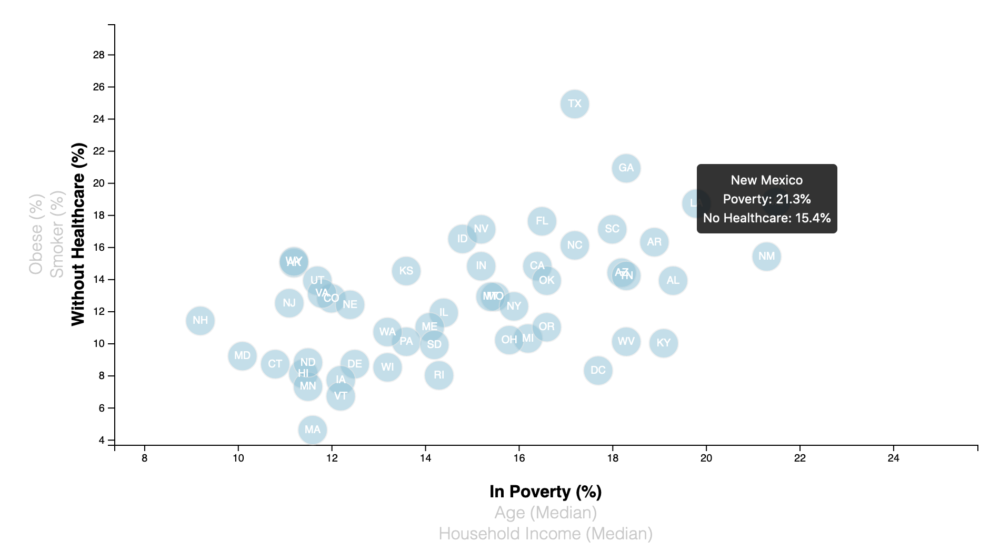

# Data Journalism and D3

## Background
Analyze the health risks facing particular demographics with the dataset provided by creating charts, graphs and interactive elements. The dataset used is from the U.S. Census Bureau is based on the 2014 ACS (American Community Survey) and includes data on rates of income, obesity, poverty, smoking, age and lack of healthcare.

## Technologies Used
* JavaScript
* D3
* HTML

## Objectives
* Create a dynamic scatter plot that represents each state with circle elements. 
* The plot will include additional labels and have click elements so users can decide which data to display. Animate the transitions for the circles' locations as well as the range of the axes.

### Static Image of Scatter Plot

### Dynamic Scatter Plot

Deployed link: https://cmoeser5.github.io/D3-challenge/
